# 实验二 测试报告

20203231004 计科1班 李达良

本报告只展示最简化的DFA矩阵图以及生成的C++源码对应的程序对各个字符串的运行结果。

## 支持的正则表达式规则

目前支持以下内容：

字符集[],括号(),连接,或运算|,闭包*,正闭包+,可选?

同时多行输入时，自动在每一行连接时用或运算拼起来。

**==该报告最终结果：题目规定所有规则均完美支持==**

## 闭包测试 a*

### DFA最小化


### 生成的程序

```C++
#include <iostream>
#include <string>

using namespace std;

int main() {
    string input;
    cout << "Enter input string: ";
    cin >> input;
    int currentState = 0;
    int length = input.length();
    for (int i = 0; i < length; i++) {
        char c = input[i];
        switch (currentState) {
            case 0:
                switch (c) {
                    case 'a':
                        currentState = 0;
                        break;
                    default:
                        cout << "Error: Invalid input character '" << c << "'" << endl;
                        return 1;
                }
                break;
        }
    }
    switch (currentState) {
        case 0:
            cout << "Accepted" << endl;
            break;
        default:
            cout << "Not Accepted" << endl;
    }
    return 0;
}
```

### 结果测试

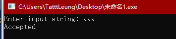

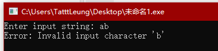

## 多行测试/或运算测试 a|b|c

### DFA最小化

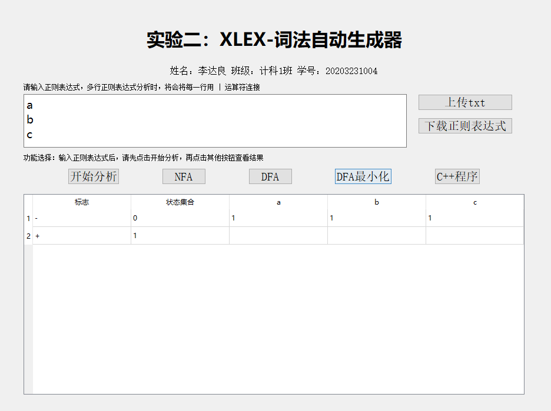

### 生成的程序

```C++
#include <iostream>
#include <string>

using namespace std;

int main() {
    string input;
    cout << "Enter input string: ";
    cin >> input;
    int currentState = 0;
    int length = input.length();
    for (int i = 0; i < length; i++) {
        char c = input[i];
        switch (currentState) {
            case 0:
                switch (c) {
                    case 'a':
                        currentState = 1;
                        break;
                    case 'b':
                        currentState = 1;
                        break;
                    case 'c':
                        currentState = 1;
                        break;
                    default:
                        cout << "Error: Invalid input character '" << c << "'" << endl;
                        return 1;
                }
                break;
            case 1:
                switch (c) {
                    case 'a':
                        cout << "Error: Invalid input character '" << c << "'" << endl;                        return 1;
                        break;
                    case 'b':
                        cout << "Error: Invalid input character '" << c << "'" << endl;                        return 1;
                        break;
                    case 'c':
                        cout << "Error: Invalid input character '" << c << "'" << endl;                        return 1;
                        break;
                    default:
                        cout << "Error: Invalid input character '" << c << "'" << endl;
                        return 1;
                }
                break;
        }
    }
    switch (currentState) {
        case 1:
            cout << "Accepted" << endl;
            break;
        default:
            cout << "Not Accepted" << endl;
    }
    return 0;
}
```

### 结果测试

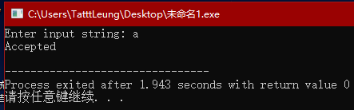

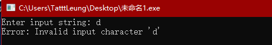

## 中括号测试 [abc]|[def]

### DFA最小化

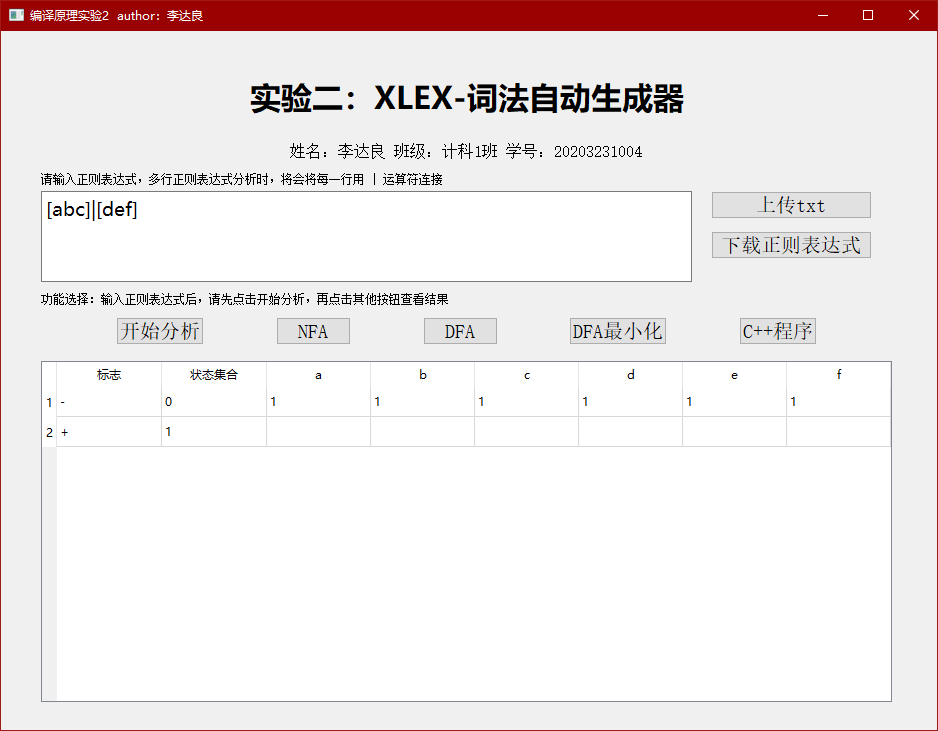

### 生成的程序

```C++
#include <iostream>
#include <string>

using namespace std;

int main() {
    string input;
    cout << "Enter input string: ";
    cin >> input;
    int currentState = 0;
    int length = input.length();
    for (int i = 0; i < length; i++) {
        char c = input[i];
        switch (currentState) {
            case 0:
                switch (c) {
                    case 'a':
                        currentState = 1;
                        break;
                    case 'b':
                        currentState = 1;
                        break;
                    case 'c':
                        currentState = 1;
                        break;
                    case 'd':
                        currentState = 1;
                        break;
                    case 'e':
                        currentState = 1;
                        break;
                    case 'f':
                        currentState = 1;
                        break;
                    default:
                        cout << "Error: Invalid input character '" << c << "'" << endl;
                        return 1;
                }
                break;
            case 1:
                switch (c) {
                    case 'a':
                        cout << "Error: Invalid input character '" << c << "'" << endl;                        return 1;
                        break;
                    case 'b':
                        cout << "Error: Invalid input character '" << c << "'" << endl;                        return 1;
                        break;
                    case 'c':
                        cout << "Error: Invalid input character '" << c << "'" << endl;                        return 1;
                        break;
                    case 'd':
                        cout << "Error: Invalid input character '" << c << "'" << endl;                        return 1;
                        break;
                    case 'e':
                        cout << "Error: Invalid input character '" << c << "'" << endl;                        return 1;
                        break;
                    case 'f':
                        cout << "Error: Invalid input character '" << c << "'" << endl;                        return 1;
                        break;
                    default:
                        cout << "Error: Invalid input character '" << c << "'" << endl;
                        return 1;
                }
                break;
        }
    }
    switch (currentState) {
        case 1:
            cout << "Accepted" << endl;
            break;
        default:
            cout << "Not Accepted" << endl;
    }
    return 0;
}
```

### 结果测试

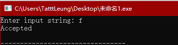


## 可选测试 a?b

### DFA最小化

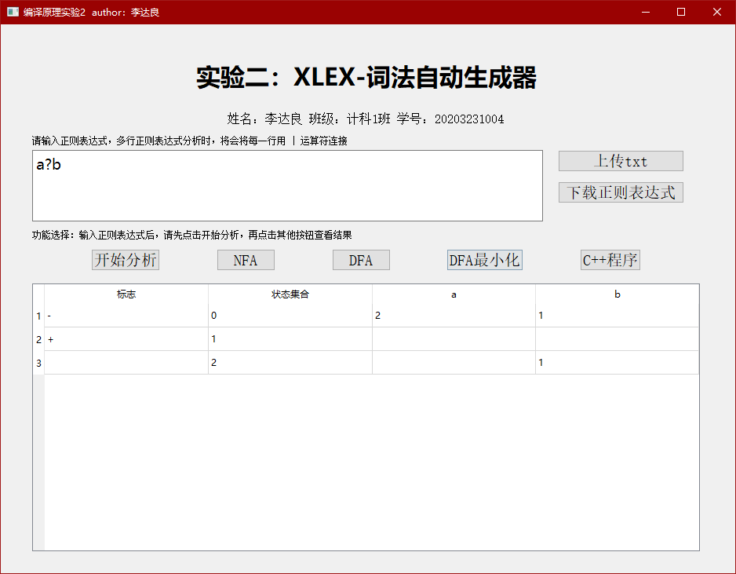

### 生成的程序

```C++
#include <iostream>
#include <string>

using namespace std;

int main() {
    string input;
    cout << "Enter input string: ";
    cin >> input;
    int currentState = 0;
    int length = input.length();
    for (int i = 0; i < length; i++) {
        char c = input[i];
        switch (currentState) {
            case 0:
                switch (c) {
                    case 'a':
                        currentState = 2;
                        break;
                    case 'b':
                        currentState = 1;
                        break;
                    default:
                        cout << "Error: Invalid input character '" << c << "'" << endl;
                        return 1;
                }
                break;
            case 1:
                switch (c) {
                    case 'a':
                        cout << "Error: Invalid input character '" << c << "'" << endl;                        return 1;
                        break;
                    case 'b':
                        cout << "Error: Invalid input character '" << c << "'" << endl;                        return 1;
                        break;
                    default:
                        cout << "Error: Invalid input character '" << c << "'" << endl;
                        return 1;
                }
                break;
            case 2:
                switch (c) {
                    case 'a':
                        cout << "Error: Invalid input character '" << c << "'" << endl;                        return 1;
                        break;
                    case 'b':
                        currentState = 1;
                        break;
                    default:
                        cout << "Error: Invalid input character '" << c << "'" << endl;
                        return 1;
                }
                break;
        }
    }
    switch (currentState) {
        case 1:
            cout << "Accepted" << endl;
            break;
        default:
            cout << "Not Accepted" << endl;
    }
    return 0;
}
```

### 结果测试

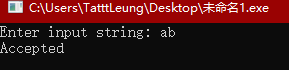

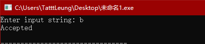

## 括号测试/与运算测试 (ab)(cd)(e|f)

### DFA最小化

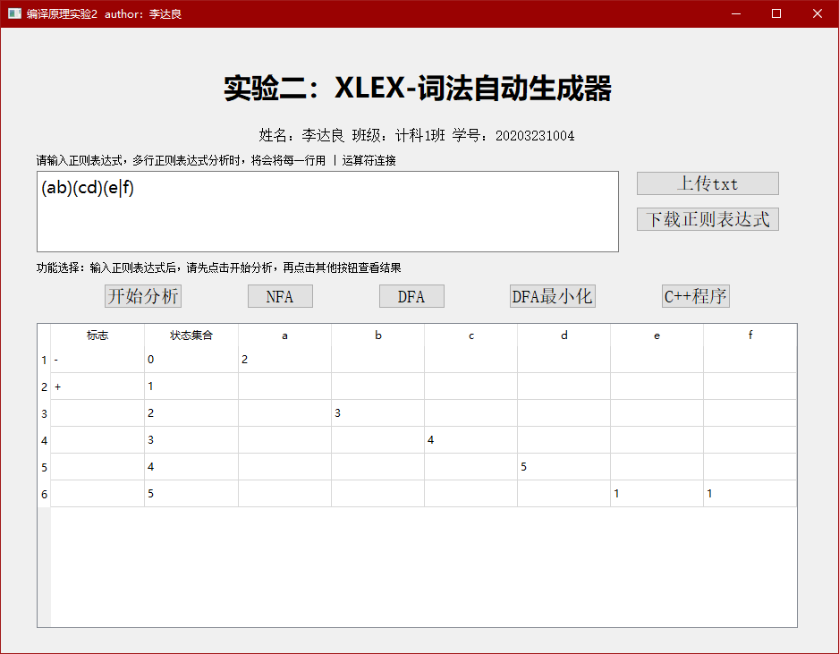

### 生成的程序

```C++
#include <iostream>
#include <string>

using namespace std;

int main() {
    string input;
    cout << "Enter input string: ";
    cin >> input;
    int currentState = 0;
    int length = input.length();
    for (int i = 0; i < length; i++) {
        char c = input[i];
        switch (currentState) {
            case 0:
                switch (c) {
                    case 'a':
                        currentState = 2;
                        break;
                    case 'b':
                        currentState = 1;
                        break;
                    default:
                        cout << "Error: Invalid input character '" << c << "'" << endl;
                        return 1;
                }
                break;
            case 1:
                switch (c) {
                    case 'a':
                        cout << "Error: Invalid input character '" << c << "'" << endl;                        return 1;
                        break;
                    case 'b':
                        cout << "Error: Invalid input character '" << c << "'" << endl;                        return 1;
                        break;
                    default:
                        cout << "Error: Invalid input character '" << c << "'" << endl;
                        return 1;
                }
                break;
            case 2:
                switch (c) {
                    case 'a':
                        cout << "Error: Invalid input character '" << c << "'" << endl;                        return 1;
                        break;
                    case 'b':
                        currentState = 1;
                        break;
                    default:
                        cout << "Error: Invalid input character '" << c << "'" << endl;
                        return 1;
                }
                break;
        }
    }
    switch (currentState) {
        case 1:
            cout << "Accepted" << endl;
            break;
        default:
            cout << "Not Accepted" << endl;
    }
    return 0;
}
```

### 结果测试

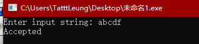

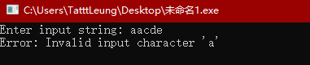

## 正闭包测试 ab+

### DFA最小化

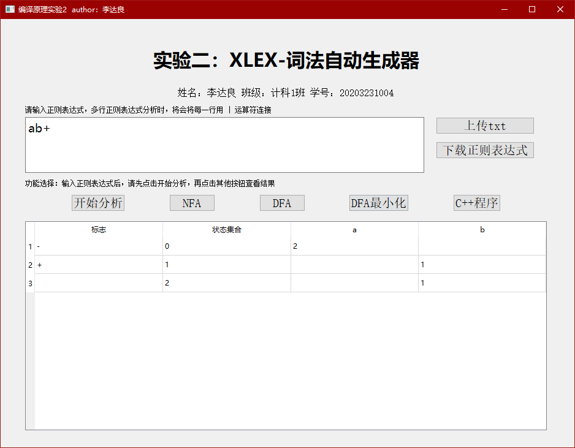

### 生成的程序

```C++
#include <iostream>
#include <string>

using namespace std;

int main() {
    string input;
    cout << "Enter input string: ";
    cin >> input;
    int currentState = 0;
    int length = input.length();
    for (int i = 0; i < length; i++) {
        char c = input[i];
        switch (currentState) {
            case 0:
                switch (c) {
                    case 'a':
                        currentState = 1;
                        break;
                    default:
                        cout << "Error: Invalid input character '" << c << "'" << endl;
                        return 1;
                }
                break;
            case 1:
                switch (c) {
                    case 'a':
                        currentState = 1;
                        break;
                    default:
                        cout << "Error: Invalid input character '" << c << "'" << endl;
                        return 1;
                }
                break;
        }
    }
    switch (currentState) {
        case 1:
            cout << "Accepted" << endl;
            break;
        default:
            cout << "Not Accepted" << endl;
    }
    return 0;
}

```

### 结果测试

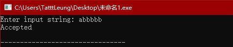

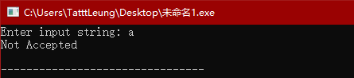

## 样例测试 l(l|d)*

### DFA最小化

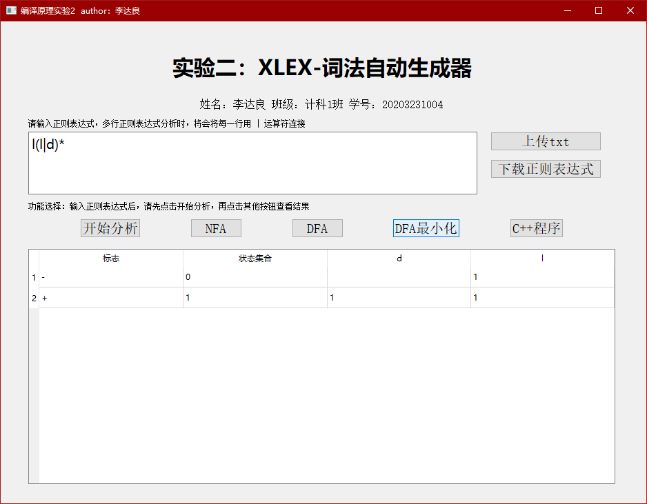

### 生成的程序

```C++
#include <iostream>
#include <string>

using namespace std;

int main() {
    string input;
    cout << "Enter input string: ";
    cin >> input;
    int currentState = 0;
    int length = input.length();
    for (int i = 0; i < length; i++) {
        char c = input[i];
        switch (currentState) {
            case 0:
                switch (c) {
                    case 'd':
                        cout << "Error: Invalid input character '" << c << "'" << endl;                        return 1;
                        break;
                    case 'l':
                        currentState = 1;
                        break;
                    default:
                        cout << "Error: Invalid input character '" << c << "'" << endl;
                        return 1;
                }
                break;
            case 1:
                switch (c) {
                    case 'd':
                        currentState = 1;
                        break;
                    case 'l':
                        currentState = 1;
                        break;
                    default:
                        cout << "Error: Invalid input character '" << c << "'" << endl;
                        return 1;
                }
                break;
        }
    }
    switch (currentState) {
        case 1:
            cout << "Accepted" << endl;
            break;
        default:
            cout << "Not Accepted" << endl;
    }
    return 0;
}
```

### 结果测试

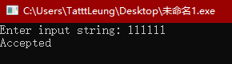

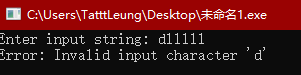

## 综合样例

因为篇幅有限，不展示生成的C++代码了，但是有兴趣可以尝试下，都是完全成功运行的。

1. `(a|b)*((aa|bb)(a|b)*)*(a|b)*((a|b)(a|b)(a|b)(a|b)(a|b))?(a|b)*((ab|ba)(ab|ba)*)*`

DFA最小化结果：

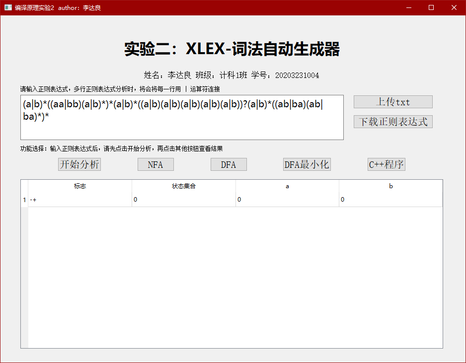

正确答案对比：

https://cyberzhg.github.io/toolbox/min_dfa?regex=KGF8YikqKChhYXxiYikoYXxiKSopKihhfGIpKigoYXxiKShhfGIpKGF8YikoYXxiKShhfGIpKT8oYXxiKSooKGFifGJhKShhYnxiYSkqKSo=

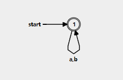


2. `(a|b)*((aa|bb)(a|b)*)+(a|b)+a?(b|a)*(ab|ba)+a*(b|a)?a?(b|a(ba)*a)+`

DFA最小化结果：

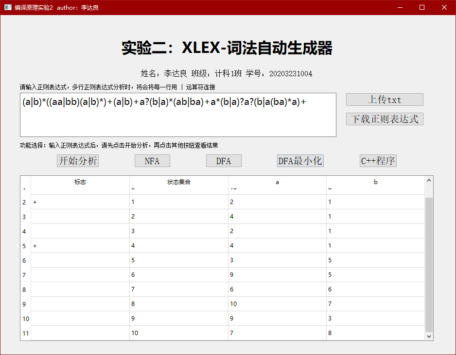

正确答案对比：

https://cyberzhg.github.io/toolbox/min_dfa?regex=KGF8YikqKChhYXxiYikoYXxiKSopKihhfGIpKigoYXxiKShhfGIpKGF8YikoYXxiKShhfGIpKT8oYXxiKSooKGFifGJhKShhYnxiYSkqKSo=

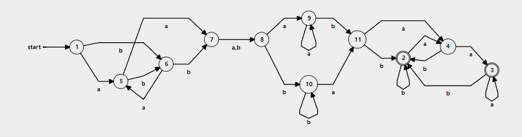

（该样例状态id不太一样，但经过转换后，两者完全一致。）

3. `a*b*(a|b)*a*a*a*b*b*b*(b|b|a)*`

DFA最小化结果：


正确答案对比：

https://cyberzhg.github.io/toolbox/min_dfa?regex=KGF8YikqKChhYXxiYikoYXxiKSopKihhfGIpKigoYXxiKShhfGIpKGF8YikoYXxiKShhfGIpKT8oYXxiKSooKGFifGJhKShhYnxiYSkqKSo=

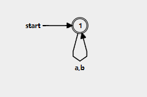